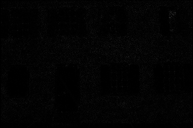
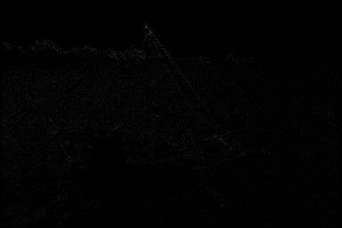
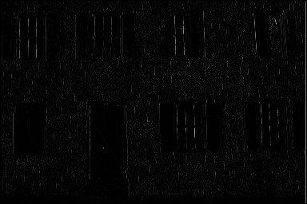
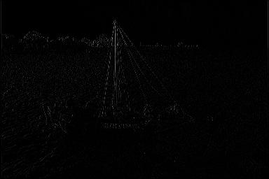
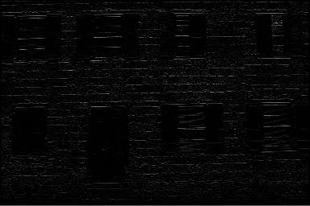
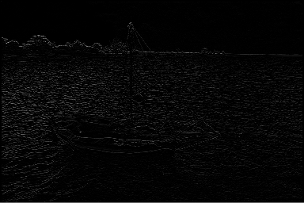
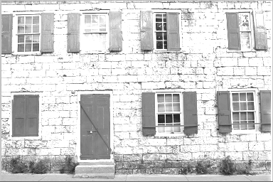
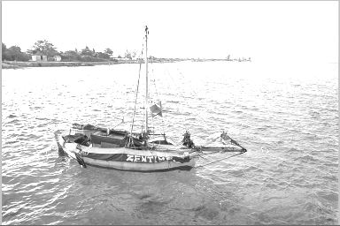
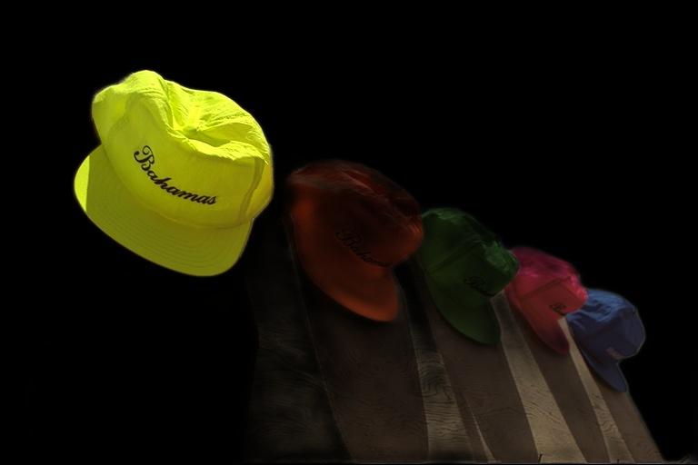
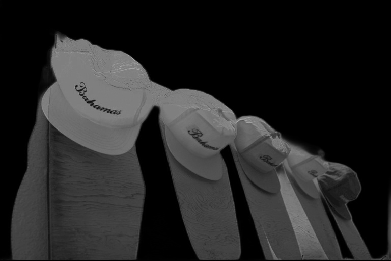

# Asymmetric-Learned-Image-Compression-with-Multi-Scale-Residual-Block

## CSN3020 Design Credit Project under Dr. Binod Kumar

## Overview of the Project

We design an asymmetric paradigm, in which the encoder employs three stages of MSRBs to improve the learning capacity, whereas the decoder only needs one stage of MSRB to yield satisfactory reconstruction, thereby reducing the decoding complexity without sacrificing performance.
We need to see the effect of change in number of MSRB blocks and also internal kernal sizes in MSRB blocks on image compression.
For such purposes, we try data and model level transformations to improve the image compression.

## Research Papers

[Asymmetric Learned Image Compression withMulti-Scale Residual Block, Importance Map, and Post-Quantization Filtering]("https://github.com/ayushabrol13/Asymmetric-Learned-Image-Compression-with-Multi-Scale-Residual-Block/blob/master/Research%20Papers/Asymmetric%20Learned%20Image%20Compression%20with.pdf")

[Learned Image Compression with Mixed Transformer-CNN Architectures]("https://github.com/ayushabrol13/Asymmetric-Learned-Image-Compression-with-Multi-Scale-Residual-Block/blob/master/Research%20Papers/Learned%20Image%20Compression%20with%20Mixed%20Transformer-CNN%20Architectures%20Updated.pdf")

## Datasets used

We have used the Kodak dataset for Image Compression using MSRB Block.
Examples from the dataset

[link]("https://github.com/ayushabrol13/Asymmetric-Learned-Image-Compression-with-Multi-Scale-Residual-Block/tree/master/kodak")

We can also use the Tecnick dataset for Image Compression using MSRB Block and the model architecture mentioned in the paper Asymmetric Learned Image Compression withMulti-Scale Residual Block, Importance Map, andPost-Quantization Filtering

## Image augmentations using classical signal processing using DWT and IDWT

1. Take dwt on each Image and we will get 4 components named (LL,LH, HL,HH).
   (L : LOW PASS FILTER) (H : HIGH PASS FILTER).

2. For each component apply encoder and decoder network model and do reconstruction using idwt from outputs of 4 components for each image.

3. As LL component is having high energy compared to others see that more depth in model for this compared to others components will improve accuracy and also reduce model complexity.

### Original

### HH

### HL

### LH

### LL

### Reconstructed using IDWT

## How to run the code

### Cloning the repo

    cd <path to clone the repo>

    git clone https://github.com/ayushabrol13/Asymmetric-Learned-Image-Compression-with-Multi-Scale-Residual-Block

### Changing directory to the cloned repo

    cd Enhancing-Voice-Activity-Detection-in-Noisy-Environments

### Creating a virtual environment (Linux Env)

    pip install virtualenv

    virtualenv venv

    source venv/bin/activate

### Setting up the dependencies

    pip install -r requirements.txt

### Downloading the Kodak Dataset

[Dataset Link](https://www.kaggle.com/datasets/sherylmehta/kodak-dataset)

### Running the DWT and IDWT

To run the complete code for data level DWT and IDWT, run through the cells of ipynb notebook `pywt_update.ipynb`

### Running the code for model level image compression

To run the complete code for model level image compression, run through the cells of ipynb notebook `main.ipynb`

### Running original scripts

To run the original scripts from the original paper:

1.  Modularize path and change the paths in the following scripts

        "scripts/Encoder_Decoder_test_cvpr_heatmap_mulitiply_block_directly_correctly_1.py"

        "scripts/test_cvpr_heatmap_mulitiply_block_diectly.py"

2.  Run the script

        python3 scripts/test_cvpr_heatmap_mulitiply_block_diectly.py

## Results

### Foreground Original Image

### Foreground Image with data level reconstruction using DWT and IDWT

### Reconstructed Foreground Image from Original Image

### Reconstructed Foreground Image from Foreground Image with data level reconstruction using DWT and IDWT

