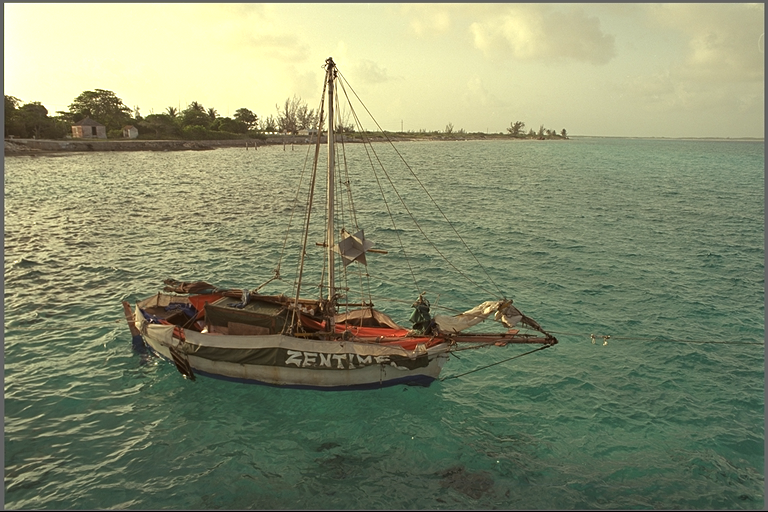
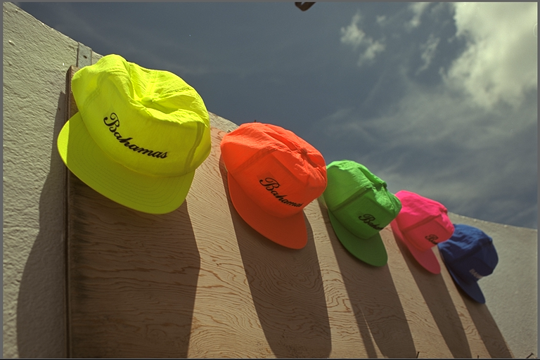

# Asymmetric-Learned-Image-Compression-with-Multi-Scale-Residual-Block

## CSN3020 Design Credit Project under Dr. Binod Kumar

## Overview of the Project

## Research Papers

[Asymmetric Learned Image Compression withMulti-Scale Residual Block, Importance Map, and Post-Quantization Filtering]("https://github.com/ayushabrol13/Asymmetric-Learned-Image-Compression-with-Multi-Scale-Residual-Block/blob/master/Research%20Papers/Asymmetric%20Learned%20Image%20Compression%20with.pdf")

[Learned Image Compression with Mixed Transformer-CNN Architectures]("https://github.com/ayushabrol13/Asymmetric-Learned-Image-Compression-with-Multi-Scale-Residual-Block/blob/master/Research%20Papers/Learned%20Image%20Compression%20with%20Mixed%20Transformer-CNN%20Architectures%20Updated.pdf")

## Datasets used

We have used the Kodak dataset for Image Compression using MSRB Block.
Examples from the dataset

[link]("https://github.com/ayushabrol13/Asymmetric-Learned-Image-Compression-with-Multi-Scale-Residual-Block/tree/master/kodak")

We can also use the Tecnick dataset for Image Compression using MSRB Block and the model architecture mentioned in the paper Asymmetric Learned Image Compression withMulti-Scale Residual Block, Importance Map, andPost-Quantization Filtering

## Image augmentations using classical signal processing using DWT and IDWT

1. Take dwt on each Image and we will get 4 components named (LL,LH, HL,HH).
   (L : LOW PASS FILTER) (H : HIGH PASS FILTER).

2. For each component apply encoder and decoder network model and do reconstruction using idwt from outputs of 4 components for each image.

3. As LL component is having high energy compared to others see that more depth in model for this compared to others components will improve accuracy and also reduce model complexity.

### HH

